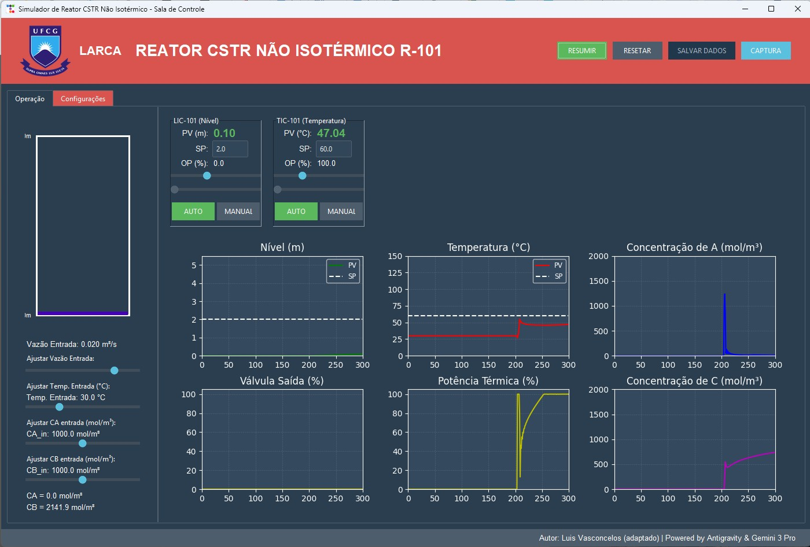

# ⚗️ Simulador de Reator CSTR Não Isotérmico

[](https://www.python.org/)
[](https://opensource.org/licenses/MIT)
[](https://ttkbootstrap.readthedocs.io/)

Um simulador educacional interativo de um **reator CSTR não isotérmico** com duas reações consecutivas e controle PID, desenvolvido para auxiliar no aprendizado de Engenharia Química.

  
*Exemplo da interface gráfica do simulador*

---

## 📚 Sobre o Projeto

Este aplicativo simula o comportamento dinâmico de um **Reator Contínuo de Tanque Agitado (CSTR)** onde ocorrem as reações:

- **A + B → C** (exotérmica)
- **A + C → D** (exotérmica)

O usuário pode interagir com o processo através de uma interface gráfica inspirada em salas de controle reais, ajustando vazões, concentrações de alimentação, temperatura e parâmetros dos controladores PID, observando em tempo real o efeito nos níveis, temperaturas e concentrações.

**Objetivo educacional:** Permitir que estudantes visualizem conceitos de cinética química, balanços de massa e energia, e sintonia de malhas de controle de forma lúdica e intuitiva, potencializando a aprendizagem através da experimentação virtual.

---

## ✨ Funcionalidades

- ✅ Modelagem dinâmica de CSTR com duas reações (cinética de Arrhenius).
- ✅ Controladores PID para **nível** (LIC-101) e **temperatura** (TIC-101).
- ✅ Interface gráfica moderna com abas de operação e configuração.
- ✅ Visualização em tempo real:
  - Nível, temperatura e concentrações de A e C no reator.
  - Abertura da válvula de saída e potência térmica aplicada.
- ✅ Ajuste contínuo de perturbações:
  - Vazão de alimentação.
  - Temperatura de entrada.
  - Concentrações de A e B na corrente de entrada.
- ✅ Sliders e faceplates para operação manual ou automática.
- ✅ Gráficos dinâmicos atualizados a cada passo.
- ✅ Salvamento do histórico de dados em CSV.
- ✅ Captura de tela da interface.
- ✅ Pausa e reset da simulação.

---

## 🛠️ Tecnologias Utilizadas

- **Python 3.8+**
- **Tkinter** + **ttkbootstrap** (para interface moderna)
- **Matplotlib** (gráficos dinâmicos)
- **NumPy** (cálculos numéricos)
- **Pandas** (manipulação de dados)
- **Pillow** (processamento de imagens)

---

## 📋 Pré-requisitos

- Python 3.8 ou superior instalado.
- Gerenciador de pacotes `pip`.

---

## 🚀 Instalação e Execução

1. **Clone o repositório:**
   ```bash
   git clone https://github.com/seu-usuario/App_CSTR.git
   cd App_CSTR

## 🎮 Como Usar

**Aba de Operação**

- **Painel esquerdo:** contém a representação visual do tanque (nível e cor variam com a temperatura) e os sliders para ajustar as perturbações (vazão, temperatura, concentrações de entrada).

- **Faceplates:** controladores de nível e temperatura. Clique em MAN para operar manualmente a válvula/potência, ou AUTO para deixar o PID atuar. O setpoint pode ser alterado no campo ou no slider.

- **Gráficos:** exibem o histórico das variáveis de processo (nível, temperatura, concentrações e saídas dos controladores).

**Aba de Configurações**

- **Permite ajustar os parâmetros:**

- **Ganhos dos controladores PID** (Kp, Ki, Kd).

- **Parâmetros do processo:** coeficiente de válvula (Cv), área do tanque.

- **Parâmetros cinéticos:** fatores pré-exponenciais (A1, A2), energias de ativação (E1, E2) e calores de reação (ΔH1, ΔH2).

- **Clique em Aplicar Parâmetros para atualizar.**

**Controles gerais**

- **PAUSAR/RESUMIR:** interrompe ou retoma a simulação.

- **RESETAR:** reinicia o reator com as condições iniciais.

- **SALVAR DADOS:** exporta o histórico para um arquivo CSV.

- **CAPTURA:** salva uma imagem da janela atual.
