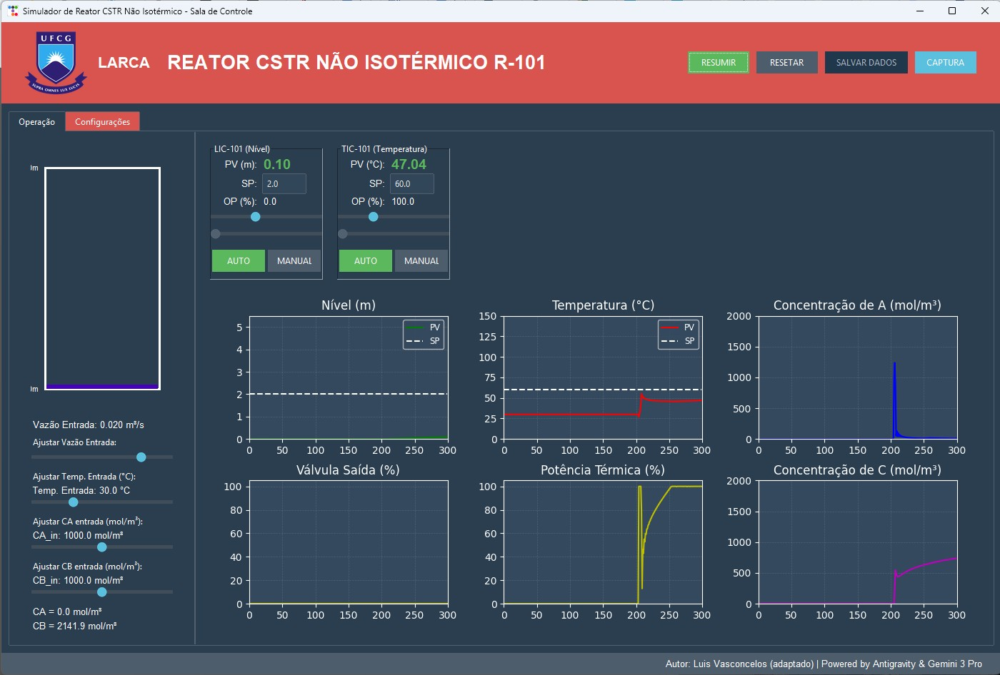

# Simulador de Reator CSTR Não-Isotérmico para Etoxilação

[](https://www.python.org/)
[](https://docs.python.org/3/library/tkinter.html)
[](https://opensource.org/licenses/MIT)

**Simulador educacional interativo** de um reator CSTR (*Continuous Stirred Tank Reactor*) não-isotérmico com cinética de etoxilação e controle PID. Desenvolvido para apoiar disciplinas de Pós-Graduação em Engenharia Química, permitindo que estudantes experimentem conceitos de cinética, balanços de massa/energia e controle de processos em tempo real.



---

## Sumário

- [Fundamentação Teórica](#fundamentação-teórica)
  - [Esquema Reacional](#esquema-reacional)
  - [Cinética Química](#cinética-química)
  - [Balanço de Massa](#balanço-de-massa)
  - [Balanço de Energia](#balanço-de-energia)
  - [Balanço de Volume](#balanço-de-volume)
  - [Controle PID](#controle-pid)
- [Estrutura do Projeto](#estrutura-do-projeto)
- [Pré-requisitos](#pré-requisitos)
- [Instalação e Execução](#instalação-e-execução)
- [Funcionalidades](#funcionalidades)
- [Guia de Uso](#guia-de-uso)
  - [Painel de Operação](#painel-de-operação)
  - [Parâmetros e Sintonia](#parâmetros-e-sintonia)
  - [Controles Gerais](#controles-gerais)
- [Interpretação de Resultados](#interpretação-de-resultados)
- [Extensões Possíveis](#extensões-possíveis)
- [Referências](#referências)
- [Autor](#autor)

---

## Fundamentação Teórica

### Esquema Reacional

O reator modela duas reações exotérmicas consecutivas:

$$(1)\quad A + B \;\xrightarrow{k_1}\; C \qquad (\text{reação principal — formação de surfactante})$$
$$(2)\quad A + C \;\xrightarrow{k_2}\; D \qquad (\text{reação secundária — subproduto indesejado})$$

Onde:

| Símbolo | Componente        | Função                          |
|---------|-------------------|----------------------------------|
| A       | Álcool graxo      | Reagente                         |
| B       | Óxido de Etileno  | Reagente gasoso                  |
| C       | Surfactante       | **Produto desejado**             |
| D       | Subproduto        | Produto da reação consecutiva    |

### Cinética Química

Ambas as reações seguem cinética elementar de 2ª ordem. A constante de velocidade é dada pela **Lei de Arrhenius**:

$$k_i(T) = A_i \cdot \exp\left(-\frac{E_i}{R \cdot T}\right)$$

$$r_1 = k_1 \cdot C_A \cdot C_B$$
$$r_2 = k_2 \cdot C_C \cdot C_A$$

Onde:

- $A_i$: fator pré-exponencial (m³/mol·s)
- $E_i$: energia de ativação (J/mol)
- $R = 8{,}314$ J/mol·K: constante universal dos gases
- $T$: temperatura absoluta (K)

### Balanço de Massa

Para um CSTR com volume variável, parte-se do balanço molar geral:

$$\frac{d(N_i)}{dt} = F_{in} \cdot C_i^{in} - F_{out} \cdot C_i + V \sum_j \nu_{ij} \, r_j$$

onde $N_i = V \cdot C_i$. Expandindo e substituindo $dV/dt = F_{in} - F_{out}$, obtém-se para cada espécie:

$$
\frac{dC_A}{dt} = \frac{F_{in}}{V}(C_A^{in} - C_A) - r_1 - r_2
$$

$$
\frac{dC_B}{dt} = \frac{F_{in}}{V}(C_B^{in} - C_B) - 2r_1
$$

$$
\frac{dC_C}{dt} = \frac{F_{in}}{V}(0 - C_C) + r_1 - r_2
$$

$$
\frac{dC_D}{dt} = \frac{F_{in}}{V}(0 - C_D) + r_2
$$

### Balanço de Energia

Para um CSTR não-isotérmico com camisa de aquecimento/resfriamento:

$$\frac{dT}{dt} = \frac{\dot{Q}_{sens} + \dot{Q}_{rxn} + \dot{Q}_{camisa}}{\rho \cdot C_p \cdot V}$$

Onde:

- $\dot{Q}_{sens} = F_{in} \cdot \rho \cdot C_p \cdot (T_{in} - T)$: calor sensível da alimentação
- $\dot{Q}_{rxn} = (-\Delta H_1) \cdot r_1 \cdot V + (-\Delta H_2) \cdot r_2 \cdot V$: calor liberado pelas reações
- $\dot{Q}_{camisa}$: calor trocado com a camisa (controle split-range)
- $\rho$: densidade da mistura (kg/m³)
- $C_p$: capacidade calorífica (J/kg·K)

### Balanço de Volume (Nível)

O nível no tanque é governado pela diferença entre vazão de entrada e saída:

$$\frac{dV}{dt} = F_{in} - F_{out}$$

A vazão de saída é modelada por uma válvula com comportamento de fluxo turbulento:

$$F_{out} = C_v \cdot f \cdot \sqrt{h}$$

$$h = \frac{V}{A_{rea}} \qquad f = \frac{OP}{100}$$

### Controle Térmico Split-Range

O sistema utiliza uma estratégia de faixa dividida (*split-range*) para acionar atuadores mutuamente exclusivos:

| Sinal (%)     | Ação          | Atuador               |
|----------------|---------------|-----------------------|
| $0$ – $49$    | Resfriamento  | Válvula de água fria  |
| $50$          | Neutro        | Nenhum                |
| $51$ – $100$  | Aquecimento   | Válvula de vapor      |

### Controle PID

Dois controladores PID operam as malhas de nível e temperatura:

- **LIC-101 (Nível)**: $K_p = -60$ (ação reversa: nível alto $\rightarrow$ saída diminui $\rightarrow$ válvula fecha)
- **TIC-101 (Temperatura)**: $K_p = +8$ (ação direta: temperatura alta $\rightarrow$ saída aumenta $\rightarrow$ resfria)

A equação do controlador na forma paralela:

$$u(t) = K_p \cdot e(t) + K_i \int_0^t e(\tau)\,d\tau + K_d \frac{de(t)}{dt}$$

com $e(t) = SP - PV$ (erro = setpoint $-$ processo).

---

## Estrutura do Projeto

```
App_CSTR/
│
├── main.py                  # Interface gráfica (sala de controle)
├── model.py                 # Modelo matemático do CSTR (EDOs)
├── pid.py                   # Controlador PID digital com anti-windup
│
├── components/
│   ├── tank_widget.py       # Visualização do tanque (Canvas)
│   └── faceplate.py         # Painel do controlador (estilo DCS)
│
├── cstr.jpg                 # Screenshot da interface
├── UFCG_logo_png.png        # Logotipo da universidade
└── README.md                # Este arquivo
```

Cada módulo contém docstrings com as equações e a lógica de modelagem, servindo também como material de consulta.

---

## Pré-requisitos

- **Python 3.8 ou superior**
- Gerenciador de pacotes `pip`
- Sistema operacional: Windows, Linux ou macOS

---

## Instalação e Execução

1. Clone o repositório:

```bash
git clone https://github.com/LVasconcelos96/App_CSTR.git
cd App_CSTR
```

2. Instale as dependências:

```bash
pip install -r requirements.txt
```

Caso não exista `requirements.txt`, instale manualmente:

```bash
pip install numpy pandas matplotlib pillow ttkbootstrap
```

3. Execute o simulador:

```bash
python main.py
```

---

## Funcionalidades

- **Modelagem fenomenológica** de CSTR com 2 reações exotérmicas (cinética de Arrhenius)
- **Controladores PID** para nível (LIC-101) e temperatura (TIC-101)
- **Modo de operação** AUTO (PID calcula) e MANUAL (operador define)
- **Gráficos dinâmicos** em tempo real: nível, temperatura, concentrações, saídas dos controladores
- **Slider de vazão** para aplicar perturbações na alimentação
- **Janela de histórico** ajustável (50 a 5000 s)
- **Exportação CSV** dos dados simulados
- **Captura de tela** da interface
- **Placar de gamificação** com razão produto/subproduto como métrica de desempenho
- **Reset completo** da simulação (modelo + PIDs + histórico)
- **Parâmetros editáveis**: ganhos PID, área do tanque, $C_v$ da válvula, constantes cinéticas

---

## Guia de Uso

### Painel de Operação

A aba principal apresenta uma divisão em dois painéis:

**Painel Esquerdo (Processo)**

- **Tanque animado**: o nível do líquido e a cor (azul = frio, vermelho = quente) refletem o estado do reator
- **Slider de Vazão**: ajusta a perturbação na alimentação ($F_{in}$) em tempo real
- **Janela do Gráfico**: controla quantos segundos de histórico são exibidos nos gráficos
- **Concentrações**: leitura numérica de $C_A$, $C_B$, $C_C$, $C_D$ no reator
- **Placar**: mostra tempo de simulação, mols acumulados de produto (C) e subproduto (D), e a razão C/D como indicador de desempenho

**Painel Direito (Controle e Gráficos)**

- **Faceplates**: LIC-101 (nível) e TIC-101 (temperatura). Cada faceplate exibe:
  - PV (*Process Variable*): valor medido em tempo real
  - SP (*Setpoint*): valor desejado, editável via campo ou *slider*
  - OP (*Output*): sinal de saída ($0$–$100\%$)
  - Botões AUTO/MAN para alternar o modo de operação
- **Gráficos**: seis gráficos atualizados a cada $0{,}5$ s:
  1. Nível (m) — PV e SP
  2. Temperatura (°C) — PV e SP
  3. Concentração de Álcool (mol/m³)
  4. Abertura da válvula de saída (%)
  5. Sinal térmico *split-range* ($0$ = frio, $100$ = vapor)
  6. Concentração de Surfactante (mol/m³)

### Parâmetros e Sintonia

Na segunda aba, é possível modificar:

**Controladores PID:**
- $K_p$ (ganho proporcional)
- $K_i$ (ganho integral)
- $K_d$ (ganho derivativo)

Dica de sintonia: comece ajustando $K_p$ para a resposta desejada, depois $K_i$ para eliminar *offset* e, por fim, $K_d$ para amortecer oscilações.

**Constantes do Sistema:**
- Área da seção transversal (m²)
- Coeficiente de válvula $C_v$
- Fatores pré-exponenciais ($A_1$, $A_2$) e energias de ativação ($E_1$, $E_2$)

Após alterar os valores, clique em **SALVAR ALTERAÇÕES**.

### Controles Gerais

| Botão           | Função                                       |
|-----------------|----------------------------------------------|
| PAUSAR/RESUMIR  | Interrompe ou retoma a simulação             |
| RESETAR         | Reinicia reator, PIDs, histórico e placar    |
| SALVAR DADOS    | Exporta o histórico para CSV                 |
| CAPTURA         | Salva *screenshot* da janela                 |

---

## Interpretação de Resultados

- **Razão C/D $> 10$**: operação excelente (alta seletividade ao produto desejado)
- **Razão C/D entre $5$ e $10$**: atenção (formação significativa de subproduto)
- **Razão C/D $< 5$**: operação ineficiente (reação consecutiva predominante)

A razão C/D é influenciada principalmente por:

- **Temperatura do reator**: $T$ alta favorece D, pois $E_2 > E_1$
- **Tempo de residência**: vazão de alimentação $\times$ nível
- **Concentração de alimentação de B**: excesso de EO acelera $r_1$, mas pode elevar $T$

---

## Extensões Possíveis

Este simulador pode ser estendido academicamente para explorar:

- **Controle em cascata** entre malhas de temperatura e vazão de refrigerante
- **Controle *feedforward*** para rejeição de perturbações na vazão de alimentação
- **Otimização em tempo real (RTO)** com função objetivo de maximizar razão C/D
- **Estimação de estados** (filtro de Kalman) para concentrações não medidas
- **Controle preditivo (MPC)** substituindo os PIDs
- **Trocador de calor** explícito com balanço do lado da camisa
- **Modelagem da cinética** com ordens de reação não elementares
- **Análise de estabilidade** (múltiplos estados estacionários em CSTR não-isotérmico)

---

## Referências

1. Fogler, H. S. (2016). *Elements of Chemical Reaction Engineering* (5th ed.). Prentice Hall.
2. Seborg, D. E., Edgar, T. F., Mellichamp, D. A., & Doyle, F. J. (2016). *Process Dynamics and Control* (4th ed.). Wiley.
3. Smith, J. M., Van Ness, H. C., & Abbott, M. M. (2005). *Introduction to Chemical Engineering Thermodynamics* (7th ed.). McGraw-Hill.
4. Marlin, T. E. (2000). *Process Control: Designing Processes and Control Systems for Dynamic Performance* (2nd ed.). McGraw-Hill.
5. Luyben, W. L. (1990). *Process Modeling, Simulation, and Control for Chemical Engineers* (2nd ed.). McGraw-Hill.

---

## Autor

**Luis Vasconcelos** — Laboratório LARCA | Universidade Federal de Campina Grande (UFCG)

*Disciplina: Controle de Processos — Pós-Graduação em Engenharia Química*
